# Visual Workflow Diagrams & User Journey Maps

*Generated: September 23, 2025*

## 🎯 Current State vs. Future State Workflows

### **Current Cleaner Workflow (35% Complete)**

```mermaid
graph TD
    A[Login] --> B[Dashboard]
    B --> C[Properties List]
    C --> D[Select Property]
    D --> E[View Details]
    E --> F[❌ WORKFLOW BREAKS]
    
    F -.-> G[❌ Missing: Check-in]
    F -.-> H[❌ Missing: Photo Evidence]
    F -.-> I[❌ Missing: Quality Checklist]
    F -.-> J[❌ Missing: Issue Reporting]
    F -.-> K[❌ Missing: Completion]
    
    style F fill:#ff9999
    style G fill:#ffcccc
    style H fill:#ffcccc
    style I fill:#ffcccc
    style J fill:#ffcccc
    style K fill:#ffcccc
```

### **Future Complete Cleaner Workflow (Target: 100%)**

```mermaid
graph TD
    A[Login] --> B[Dashboard<br/>📱 Today's Schedule]
    B --> C[Properties List<br/>🔍 Filtered by Today]
    C --> D[Select Property<br/>👥 Guest Count Visible]
    D --> E[Property Details<br/>🔑 Access Codes<br/>📋 Special Instructions]
    
    E --> F[✅ Check-In Button]
    F --> G[Start Cleaning Timer]
    G --> H[Quality Checklist<br/>📝 Room-by-Room Tasks]
    H --> I[Photo Evidence<br/>📸 Before/After Shots]
    
    I --> J{Issues Found?}
    J -->|Yes| K[Report Issue<br/>📞 Auto-notify Owner]
    J -->|No| L[Complete Cleaning]
    K --> L
    
    L --> M[Final Photos<br/>✅ Completion Evidence]
    M --> N[Check-Out<br/>⏰ Time Logged]
    N --> O[Submit Report<br/>📋 Summary & Notes]
    O --> P[Payment Calculated<br/>💰 Instant Earnings]
    
    style A fill:#e1f5fe
    style P fill:#c8e6c9
```

### **Current Property Owner Workflow (25% Complete)**

```mermaid
graph TD
    A[Login] --> B[Dashboard<br/>📊 Static Stats]
    B --> C[Properties List]
    C --> D[View Property]
    D --> E[❌ Limited Actions<br/>Alert Buttons Only]
    
    E -.-> F[❌ Missing: Real Scheduling]
    E -.-> G[❌ Missing: Cleaner Assignment]
    E -.-> H[❌ Missing: Progress Monitoring]
    E -.-> I[❌ Missing: Performance Analytics]
    E -.-> J[❌ Missing: Guest Communication]
    
    style E fill:#ff9999
    style F fill:#ffcccc
    style G fill:#ffcccc
    style H fill:#ffcccc
    style I fill:#ffcccc
    style J fill:#ffcccc
```

### **Future Complete Owner Workflow (Target: 100%)**

```mermaid
graph TD
    A[Login] --> B[Smart Dashboard<br/>📊 Real-time Stats<br/>⚡ Live Alerts]
    B --> C[Properties Overview<br/>🏠 Status Grid View]
    
    C --> D{Select Action}
    D -->|Monitor| E[Live Cleaning Status<br/>📍 GPS Tracking<br/>📸 Photo Updates]
    D -->|Schedule| F[Calendar Interface<br/>📅 Drag & Drop Scheduling]
    D -->|Assign| G[Cleaner Marketplace<br/>⭐ Rating & Availability]
    D -->|Analyze| H[Performance Dashboard<br/>📈 Revenue Analytics]
    
    E --> I[Real-time Notifications<br/>📱 Push + SMS Updates]
    F --> J[Auto-conflict Resolution<br/>🤖 Smart Suggestions]
    G --> K[Automated Assignments<br/>🎯 Best Match Algorithm]
    H --> L[Predictive Insights<br/>🔮 Revenue Optimization]
    
    I --> M[Issue Escalation<br/>🚨 Emergency Protocols]
    J --> N[Guest Communication<br/>💬 Auto Status Updates]
    K --> O[Performance Tracking<br/>📊 Cleaner Scorecards]
    L --> P[Business Intelligence<br/>💰 Profit Optimization]
    
    style B fill:#e8f5e8
    style P fill:#c8e6c9
```

---

## 🔄 Data Flow Architecture

### **Current Data Architecture**

```mermaid
graph LR
    A[Supabase Auth] --> B[User Profile]
    B --> C[Role-based Access]
    C --> D[Static Mock Data]
    D --> E[Component Rendering]
    
    F[Real Database] -.-> G[❌ Limited Integration]
    H[File Storage] -.-> I[❌ No Photo Handling]
    J[Notifications] -.-> K[❌ No Real-time Updates]
    
    style D fill:#ffcccc
    style G fill:#ffcccc
    style I fill:#ffcccc
    style K fill:#ffcccc
```

### **Target Data Architecture**

---

## 🎨 User Interface Flow Diagrams

### **Cleaner Mobile Interface Flow**

```mermaid
graph TD
    A[📱 Mobile Login] --> B[🏠 Today's Properties<br/>📍 Location-sorted]
    B --> C[🔍 Property Selection<br/>👥 Guest Count Prominent]
    
    C --> D[📋 Property Brief<br/>🔑 Access Info<br/>📶 WiFi Credentials]
    D --> E[✅ Check-In<br/>📍 GPS Verification]
    E --> F[🧹 Cleaning Interface<br/>📝 Task Checklist]
    
    F --> G[📸 Photo Capture<br/>🏠 Room-by-Room]
    G --> H{🚨 Issues?}
    H -->|Yes| I[📞 Issue Report<br/>🆘 Emergency Contact]
    H -->|No| J[✅ Complete Tasks]
    
    I --> K[📸 Issue Documentation]
    K --> L[📱 Owner Notification]
    L --> J
    
    J --> M[📸 Final Evidence]
    M --> N[✅ Check-Out<br/>⏱️ Time Summary]
    N --> O[💰 Earnings Summary<br/>⭐ Job Rating]
    
    style A fill:#e3f2fd
    style O fill:#c8e6c9
```

### **Owner Dashboard Interface Flow**

```mermaid
graph TD
    A[💻 Owner Dashboard] --> B[📊 Performance Overview<br/>💰 Revenue Tracking]
    B --> C{Select Management Area}
    
    C -->|Properties| D[🏠 Property Grid<br/>📈 Status Overview]
    C -->|Schedule| E[📅 Calendar View<br/>🔄 Drag & Drop]
    C -->|Team| F[👥 Cleaner Management<br/>⭐ Performance Scores]
    C -->|Analytics| G[📊 Business Intelligence<br/>🎯 Optimization Tips]
    
    D --> H[🏠 Property Details<br/>📋 Cleaning History]
    E --> I[📅 Schedule Management<br/>🤖 Auto-assignments]
    F --> J[👤 Cleaner Profiles<br/>📈 Performance Tracking]
    G --> K[📊 Revenue Analytics<br/>🔮 Predictive Insights]
    
    H --> L[⚙️ Property Settings<br/>🔧 Access Management]
    I --> M[🔔 Notification Center<br/>📱 Real-time Alerts]
    J --> N[💼 Team Coordination<br/>📞 Communication Hub]
    K --> O[💡 Business Recommendations<br/>🚀 Growth Strategies]
    
    style A fill:#f3e5f5
    style O fill:#c8e6c9
```

---

## 🔗 Integration Workflow Diagrams

### **Calendar & Booking Integration**

### **Issue Resolution Workflow**

---

## 📊 Performance Optimization Workflows

### **Cleaner Efficiency Optimization**

```mermaid
graph TD
    A[📊 Data Collection] --> B[⏱️ Time Tracking<br/>📍 Route Optimization<br/>📸 Quality Metrics]
    B --> C[🤖 AI Analysis]
    C --> D[🎯 Performance Insights]
    
    D --> E{Optimization Areas}
    E -->|Route| F[🗺️ Smart Routing<br/>⛽ Fuel Savings]
    E -->|Time| G[⏰ Task Optimization<br/>📋 Checklist Refinement]
    E -->|Quality| H[📚 Training Recommendations<br/>⭐ Skill Development]
    
    F --> I[📱 Real-time Navigation]
    G --> J[📝 Personalized Checklists]
    H --> K[🎓 Training Modules]
    
    I --> L[💰 Increased Earnings]
    J --> L
    K --> L
    
    style A fill:#e8f5e8
    style L fill:#c8e6c9
```

### **Revenue Optimization Workflow**

```mermaid
graph TD
    A[📈 Revenue Data] --> B[💰 Property Performance<br/>⏰ Turnaround Times<br/>⭐ Guest Satisfaction]
    B --> C[🤖 AI Analytics]
    C --> D[🎯 Optimization Recommendations]
    
    D --> E{Revenue Drivers}
    E -->|Pricing| F[💲 Dynamic Pricing<br/>📊 Market Analysis]
    E -->|Efficiency| G[⚡ Faster Turnarounds<br/>🔄 Process Optimization]
    E -->|Quality| H[⭐ Higher Ratings<br/>🏆 Premium Positioning]
    
    F --> I[📈 Increased Bookings]
    G --> J[💰 Cost Reduction]
    H --> K[⭐ Premium Rates]
    
    I --> L[💸 Maximum ROI]
    J --> L
    K --> L
    
    style A fill:#fff3e0
    style L fill:#c8e6c9
```

---

## 🚀 Implementation Roadmap Workflow

### **Phase 1: Core Completion (Weeks 1-2)**

### **Phase 2: Integrations (Weeks 3-4)**

---

## 🎯 Success Metrics Dashboard

### **Key Performance Indicators (KPIs)**

```mermaid
graph TD
    A[📊 KPI Dashboard] --> B[👥 User Engagement]
    A --> C[⚡ Operational Efficiency] 
    A --> D[💰 Financial Performance]
    A --> E[⭐ Quality Metrics]
    
    B --> F[📱 Daily Active Users<br/>⏱️ Session Duration<br/>🔄 Feature Adoption]
    C --> G[⚡ Turnaround Times<br/>📅 Schedule Efficiency<br/>🎯 Issue Resolution]
    D --> H[💰 Revenue per Property<br/>💸 Cost Reduction<br/>📈 Profit Margins]
    E --> I[⭐ Guest Satisfaction<br/>🧹 Cleaning Quality<br/>💯 Completion Rates]
    
    F --> J[🎯 85% Daily Usage Goal]
    G --> K[🎯 4-hour Turnaround Goal]
    H --> L[🎯 20% Revenue Increase Goal]
    I --> M[🎯 4.8/5 Quality Goal]
    
    style J fill:#c8e6c9
    style K fill:#c8e6c9
    style L fill:#c8e6c9
    style M fill:#c8e6c9
```

---

*These diagrams provide a comprehensive visual guide for understanding current gaps and implementing the complete user workflow system. Each diagram can be used for development planning, stakeholder presentations, and user training.*
