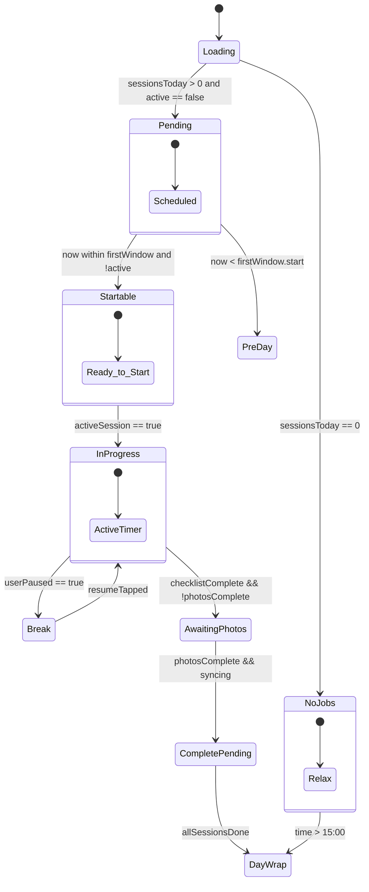
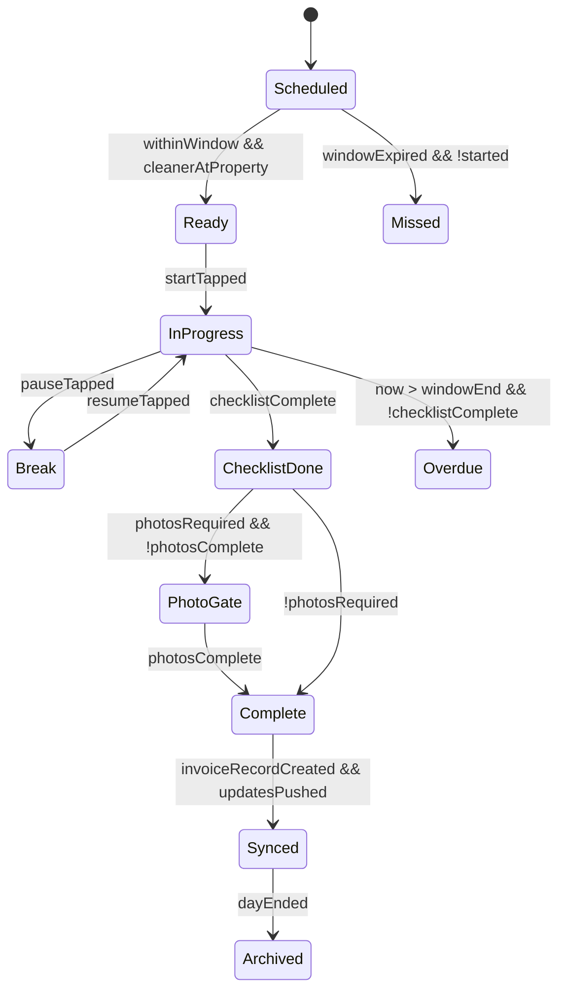
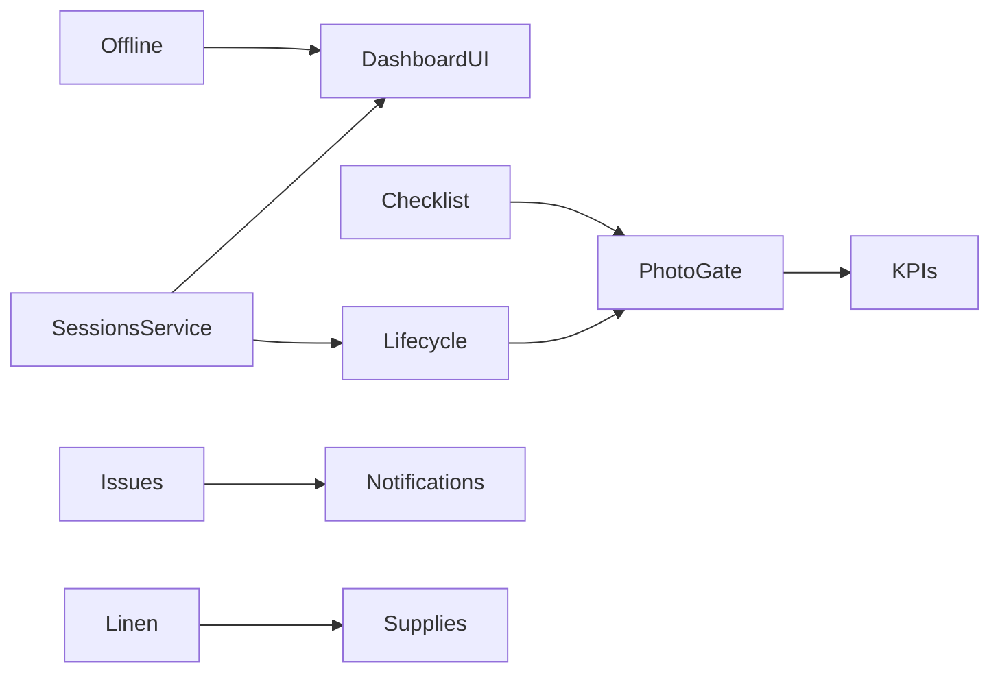

# 🖼 Vision of the Dashboard (Cleaner’s First View)

```mermaid
flowchart TD
    A[Cleaner Dashboard]

    %% MAIN NAVIGATION
    A --> B[Properties Section]
    A --> C[Schedule Section]
    A --> D[Profile Section]

    %% PROPERTIES
    B --> B1[Property Card List]
    B1 --> B2[Property Card]
    B2 --> B2a[Property Info: Name, Address, Time]
    B2 --> B2b[Guest Count]
    B2 --> B2c[Access Method / Code]

    %% Property Card Actions
    B2 --> E[📋 Tasks View]
    E --> E1[Room-by-Room Checklist]
    E --> E2[Swipe/Tick Complete]
    E --> E3[Upload Before/After Photos]

    B2 --> F[🧺 Linen View]
    F --> F1[Auto Linen Requirements]
    F --> F2[Storage Location Info]
    F --> F3[Report Linen Missing]

    B2 --> G[ℹ️ Instructions View]
    G --> G1[Special Instructions (Pets, Eco, etc.)]
    G --> G2[Wi-Fi Credentials]
    G --> G3[Emergency Contact]

    %% SCHEDULE
    C --> C1[Day View: Timeline]
    C --> C2[Week View: 7-Day Overview]

    %% Day View Cards
    C1 --> C1a[Schedule Item Card]
    C1a --> C1a1[Property + Time Slot]
    C1a --> C1a2[Guest Count + Access Info]
    C1a --> C1a3[Status: Scheduled/In Progress/Completed]

    %% Actions inside Schedule
    C1a --> H[▶ Start Cleaning → Timer + Checklist]
    C1a --> I[✔ Mark Complete → Upload Photos + Close Job]
    C1a --> J[Tap → Property Details (links back to Properties Section)]

    %% PROFILE
    D --> D1[Personal Information]
    D1 --> D1a[Name, Email, Phone]
    D1 --> D1b[Bank Details]
    D1 --> D1c[Documents (ID Verification)]
    D1 --> D1d[Edit Profile Button]

    D --> D2[Availability Settings]
    D2 --> D2a[Day Toggles (Mon–Sun)]
    D2 --> D2b[Preferred Working Hours]
    D2 --> D2c[Mark Unavailable]

    D --> D3[Performance Stats]
    D3 --> D3a[⭐ Average Rating]
    D3 --> D3b[🧹 Jobs Completed]
    D3 --> D3c[⏱️ On-Time Rate]
    D3 --> D3d[Recent Reviews]

    D --> D4[App Settings]
    D4 --> D4a[🔔 Notifications Toggle]
    D4 --> D4b[🌙 Dark Mode Toggle]
    D4 --> D4c[🚪 Sign Out]
```

# Properties Section example

---

## 🧭 Cleaner Dashboard Detailed Design

This section expands the cleaner dashboard so a cleaner can: (1) instantly see whether they are working today, (2) start or resume a clean in one tap, (3) access access codes / linen needs without drilling 4–5 screens deep, (4) capture proof (photos & time) for invoicing, and (5) raise issues fast. All diagrams are implementation guides – keep wording in UI human + low stress.

### 1. High-Level Layout (Single Screen Mental Model)

Top area = context (date, greeting, today load). Middle = next/active work + essentials. Lower = secondary utilities. Bottom nav already exists (Properties / Schedule / Profile) but dashboard is the “home”.

```mermaid
flowchart LR
        subgraph TOP[Top Bar]
            DT[Date & Local Time\n(Realtime clock)] --- MSG[Message Icon]
            DT --- NOTIF[Notification Badge]
            DT --- SYNC[Sync / Offline Indicator]
        end

        subgraph STATUS[Greeting / Status Banner]
            WELC>Dynamic Welcome Message]\nExamples:\n- "Relax – no cleans today"\n- "Welcome – 2 cleans scheduled"\n- "In progress: 1 active clean"\n- "Break mode – resume when ready"
        end

        subgraph PRIMARY[Primary Action Zone]
            NX[Next Cleaning Card\n(Property • Time Window • Access Code)]
            ACT[Active Session Card\n(If running: elapsed time • checklist %)]
            QA[Quick Access Grid]
            QA --> QA1[Access Code]
            QA --> QA2[Linen Requirements]
            QA --> QA3[Start / Resume]
            QA --> QA4[Report Issue]
            QA --> QA5[Upload Photos]
            QA --> QA6[Lost & Found]
        end

        subgraph SECONDARY[Secondary Insights]
            KPI[Mini KPIs\nJobs Today • On-Time % • Rating]
            ALERT[Risk / Alert Panel\nLate risk • Missing photos]
            SUP[Supply / Linen Shortages]
        end

        subgraph NAV[Navigation Shortcuts]
            NAV1[Full Schedule]
            NAV2[All Properties]
            NAV3[Performance]
            NAV4[Settings]
        end

        TOP --> STATUS --> PRIMARY --> SECONDARY --> NAV
```

### 2. Component Zones (Clickable Concept)

Shows what each module must deliver immediately (no hidden info).

```mermaid
flowchart TD
        A[Dashboard Screen]
        A --> Z1[Top Bar]
        Z1 --> Z1a[Date/Time]
        Z1 --> Z1b[Messages Icon]
        Z1 --> Z1c[Notifications]
        Z1 --> Z1d[Offline/Sync]

        A --> Z2[Status Banner]
        Z2 --> Z2a[Welcome Text]
        Z2 --> Z2b[Today Job Count]
        Z2 --> Z2c[Active Session Shortcut]

        A --> Z3[Next Job Card]
        Z3 --> Z3a[Property Name]
        Z3 --> Z3b[Time Window 11–15]
        Z3 --> Z3c[Access Code Large]
        Z3 --> Z3d[Guest Count → Linen]

        A --> Z4[Active Session Card]
        Z4 --> Z4a[Timer]
        Z4 --> Z4b[Checklist Progress %]
        Z4 --> Z4c[Photos Status]
        Z4 --> Z4d[Pause / Break]

        A --> Z5[Quick Actions Row]
        Z5 --> QA1[Start/Resume]
        Z5 --> QA2[Access]
        Z5 --> QA3[Linen]
        Z5 --> QA4[Issue]
        Z5 --> QA5[Photos]
        Z5 --> QA6[Lost & Found]

        A --> Z6[Alerts Panel]
        Z6 --> Z6a[Late Risk]
        Z6 --> Z6b[Missing Photo]
        Z6 --> Z6c[Unconfirmed Arrival]

        A --> Z7[Mini KPIs]
        Z7 --> Z7a[Jobs Today]
        Z7 --> Z7b[On-Time %]
        Z7 --> Z7c[Rating]
        Z7 --> Z7d[Photo Compliance]

        A --> Z8[Supply / Linen Panel]
        Z8 --> Z8a[Linen Shortage]
        Z8 --> Z8b[Consumables Low]
        Z8 --> Z8c[Restock Pending]

        A --> Z9[Bottom Nav Shortcuts]
```



### 3. Dynamic Welcome Message Logic

Logic driving the banner text – derived from today’s sessions + active session + current time vs cleaning windows.



Banner text examples mapping:

- NoJobs.Relax → "Relax – no cleans today"
- Pending.Scheduled → "You have {{count}} cleans – first at {{time}}"
- Startable.Ready_to_Start → "Ready: tap Start to begin {{property}}"
- InProgress.ActiveTimer → "Cleaning {{property}} – {{elapsed}}"
- Break → "Paused – resume when ready"
- AwaitingPhotos → "Add after photos to finish"
- DayWrap → "Great job – day complete"

### 4. Quick Actions & Data Flow

Data always fetched through service layer (no direct DB from UI). Real-time updates push to dashboard via subscriptions.

```mermaid
flowchart LR
        subgraph UI[Dashboard Quick Actions]
            BTN1[Start/Resume]
            BTN2[Access Code]
            BTN3[Linen]
            BTN4[Issue]
            BTN5[Photos]
            BTN6[Lost & Found]
        end

        subgraph Services
            CSS[cleaningSessionService]
            PVS[propertyService]
            NTS[notificationService]
        end

        subgraph DB[(Supabase Tables)]
            T1[cleaning_sessions]
            T2[properties]
            T3[linen_requirements]
            T4[maintenance_tickets]
            T5[cleaning_updates]
            T6[notifications]
            T7[lost_found (future)]
        end

        BTN1 --> CSS --> T1
        BTN1 --> CSS --> T5
        BTN2 --> PVS --> T2
        BTN3 --> CSS --> T3
        BTN4 --> CSS --> T4
        BTN5 --> CSS --> T5
        BTN6 --> CSS --> T7
        CSS --> NTS --> T6
        T1 -->|realtime| UI
        T5 -->|realtime| UI
        T6 -->|badge count| UI
```

### 5. Session Status & Time Tracking (Extended)



Notes:

- Overdue triggers red alert + notification to owner.
- PhotoGate ensures proof before invoicing.
- Synced stage creates immutable audit trail for billing.

### 6. Information Hierarchy & Zero-Stress Principles

1. Zero cognitive load: show access code LARGE on both Next Job and Active Session.
2. One tap to start – no modal confirmation unless outside window.
3. Always show current time + window boundary (e.g., "Ends 15:00"), color shifts amber when 30 mins left.
4. Passive progress meter (no nagging) but highlight missing critical steps.
5. Offline safe: property instructions + access code cached before day begins.
6. Alerts only for actionable items: (a) time risk, (b) missing photos, (c) overdue start.
7. Everything invoice-relevant auto captured (start/end time, checklist steps, photos count).

### 7. Future Enhancements (Optional Roadmap)

- Route optimization between multiple properties.
- Smart ETA prediction and automatic late warning push.
- Voice-driven checklist marking (hands free).
- Adaptive task ordering (AI reorder for efficiency).
- Gamified streaks for on-time completion.
- Predictive supply restock suggestions based on historical consumption.

---

## Implementation Guidance (Plain English)

Build the dashboard first with static mock data, then progressively wire:

1. Load today’s sessions via `cleaningSessionService.getTodaySessions()` (to be created if missing).
2. Derive banner state using simple function: inputs (sessions, activeSession, now).
3. Use a single real-time channel subscribing to `cleaning_sessions`, `cleaning_updates`.
4. Store lightweight UI state (active timer start timestamp) locally; compute elapsed on render.
5. Gate completion button until checklistComplete && photosComplete.
6. Persist pause/resume events into `cleaning_updates` for audit.

> Key Business Value: Cleaner reduces app navigation time, owner gains reliable proof trail, fewer missed windows, faster dispute resolution, and smooth invoicing.

---

## 📦 Development Phases (Execution Roadmap)

Structured implementation path so you can open GitHub issues in a logical order. Each phase produces shippable user value and de‑risks the next.

### Legend

- (E) Epic (create one umbrella issue)
- (S) Story / Task (individual issue)
- ⛳ Milestone Output described in plain English
- 🔗 Dependency prerequisite

---

### Phase 1 – Core Cleaner Dashboard MVP

Goal: Deliver a functional dashboard that shows today’s sessions, allows starting/finishing a clean with time + photo proof, and pushes real-time status.

#### Epics & Tasks

1. (E) Data Access Foundation
    - (S) Add `cleaningSessionService.getTodaySessions()`
    - (S) Add real-time subscription (sessions + cleaning_updates)
    - (S) Extend types: `CleanerDashboardSession`, `SessionProgressMeta`
    - (S) Add utility: derive cleaning window validity

2. (E) Dashboard UI Skeleton
    - (S) Create `CleanerDashboardScreen` (or enhance existing `index.tsx` with role split)
    - (S) Implement Top Bar (date/time live clock + notification badge placeholder)
    - (S) Implement Status Banner (static variants first)
    - (S) Implement Next Job Card (mock data → real data)

3. (E) Session Lifecycle Basic
    - (S) Add service methods: `startSession`, `pauseSession`, `resumeSession`, `completeSession`
    - (S) Record events in `cleaning_updates` (start/pause/resume/complete)
    - (S) Active Session Card (timer derived from start timestamp)
    - (S) Checklist progress placeholder (static % for now)

4. (E) Photo Proof Gate (Basic)
    - (S) Add minimal photo capture integration placeholder (no storage yet – simulate)
    - (S) Add `photosRequired` logic (always true Phase 1)
    - (S) Gate completion button until mock photosPresent flag set

5. (E) Banner State Logic
    - (S) Implement banner state machine function (pure function + unit test optional)
    - (S) Map states → text copy (from section above)
    - (S) Integrate with dashboard re-renders (sessions or activeSession changes)

6. (E) Basic Alerts
    - (S) Compute late risk (now > start + X mins w/out start) – show simple red pill
    - (S) Compute missing photos (checklistComplete && !photosComplete) – amber pill

7. (E) Persistence & Offline Cache (Lite)
    - (S) Preload today’s property access codes + instructions into local memory (simple in-memory retention)
    - (S) Show offline badge if network error (simulate by catching fetch error)

✅ Milestone Output: Cleaner can open app, see today’s list, start a session, pause/resume, add mock photos, and mark complete with gated flow. Owner could (later) trust timestamps.

Acceptance Criteria (Phase 1):

- Dashboard renders within 1s with mock fallback if network delayed.
- Start button disabled if current time before session window.
- Timer shows elapsed minutes (refreshing every ~30s is fine initially).
- Completion impossible until photos flag true.
- Banner text changes when session starts / completes.
- Real-time update triggers UI change when a second device modifies a session (smoke test scenario).

---

### Phase 2 – Operational Depth & Real Data

Goal: Replace placeholders with real checklist, photos, proper storage, and richer quick actions.

1. (E) Checklist System
    - (S) Define checklist schema (in-code list or new table) – tasks by room
    - (S) UI: Room accordion + tick items
    - (S) Progress % = completed / total
    - (S) Mark checklistComplete when 100%

2. (E) Photo Capture Real Storage
    - (S) Integrate Supabase storage bucket `cleaning_photos`
    - (S) Before / After required sets (enforce at least 2 categories)
    - (S) Store metadata row in `cleaning_updates` or new `cleaning_media` table (if created)
    - (S) Update PhotoGate: counts validated from DB

3. (E) Linen Requirements Panel
    - (S) Service: compute linen based on guest_count + property type
    - (S) Show shortages vs requirements (UI panel)
    - (S) Add "Report Shortage" action -> creates maintenance/linen ticket

4. (E) Issue Reporting
    - (S) UI modal: category, priority, notes, photo
    - (S) Service call to `maintenance_tickets`
    - (S) Trigger notification to owner via `notificationService`

5. (E) Lost & Found (Initial)
    - (S) Create `lost_found` table (if not existing) – columns: id, session_id, property_id, description, photo_url, status, created_at
    - (S) Service: `logItem`, `listItemsBySession`
    - (S) Quick action button flows to form

6. (E) Supply / Consumables Tracking (Lite)
    - (S) Add static consumables checklist (toilet paper, soap, etc.)
    - (S) UI toggle each low item -> creates "supply_request" (table or reuse maintenance with type 'supply')

7. (E) KPIs & Mini Metrics
    - (S) Compute Jobs Today (# sessions)
    - (S) On-Time % (arrived before window midpoint)
    - (S) Rating placeholder (constant or fetched if ratings table exists later)
    - (S) Photo compliance % (# sessions with required photo sets / total completed)

8. (E) Offline Cache Enhancement
    - (S) Cache property instructions & last known access codes in AsyncStorage
    - (S) Detect offline on start -> use cached copy

✅ Milestone Output: Production-ready cleaner dashboard supporting real proof data, issue flows, linen insight, and basic operational metrics.

Acceptance Criteria (Phase 2):

- Checklist persists and reloads on screen reopen.
- At least one photo per required category enforced before completion.
- Issues and shortages appear in owner-facing views (future integration stub accepted).
- Lost & Found items listable for active session.
- KPI numbers update after session completion without app restart.
- Offline mode displays cached instructions when network unavailable.

---

### Phase 3 – Optimization & Intelligence (Future)

Goal: Efficiency + predictive support.

Epics:

1. Route & Travel Time (mapping API integration)
2. Predictive Late Risk (pre-window pre-warn)
3. Adaptive Checklist Ordering (time-based reorder)
4. Gamification & Streaks
5. Advanced Supply Forecasting
6. Multi-language / Localization

Acceptance Snapshot:

- Route suggestion reduces travel idle (tracked metric later).
- Late risk predicted ≥15 mins before risk window 70% accuracy.
- Streak badge visible after N consecutive on-time days.

---

### Dependency Graph (Simplified)



---

### Suggested GitHub Issue Template Snippets

**Title:** Phase 1: Implement Active Session Card
**Body:**
Purpose: Show running clean with elapsed time & progress.
Includes: timer calc, pause/resume buttons, mock checklist %, state integration.
Done When: Starting a session immediately shows card with ticking elapsed (manual refresh ok Phase 1).

**Title:** Phase 2: Photo Storage Integration
**Body:**
Purpose: Persist before/after sets to Supabase storage; enforce counts; feed PhotoGate.
Tables: use storage bucket + reference rows.
Done When: Completion blocked until min photos present; refresh shows persisted counts.

---

### Opening Issues Order (Initial 10)

1. Phase 1: Add getTodaySessions service method
2. Phase 1: Real-time subscription setup
3. Phase 1: Dashboard UI skeleton + top bar
4. Phase 1: Status banner state machine
5. Phase 1: Next Job & Active Session cards
6. Phase 1: Session lifecycle service methods (start/pause/resume/complete)
7. Phase 1: Photo gate placeholder (mock)
8. Phase 1: Alerts (late risk / missing photos)
9. Phase 1: Offline cache (in-memory)
10. Phase 1: Acceptance review & polish

---

### Metrics to Track Post Phase 2

- Avg time from app open → session start
- % sessions with complete photo sets
- % sessions started within 15 mins of checkout
- Issue report rate per 100 cleans
- Rework rate (future: returns)

---

## Quick Start For Next Sprint

Start with Issues #1–#3 (services and skeleton) – these unblock everything else. Avoid building checklist/photos fully until base lifecycle solid.
